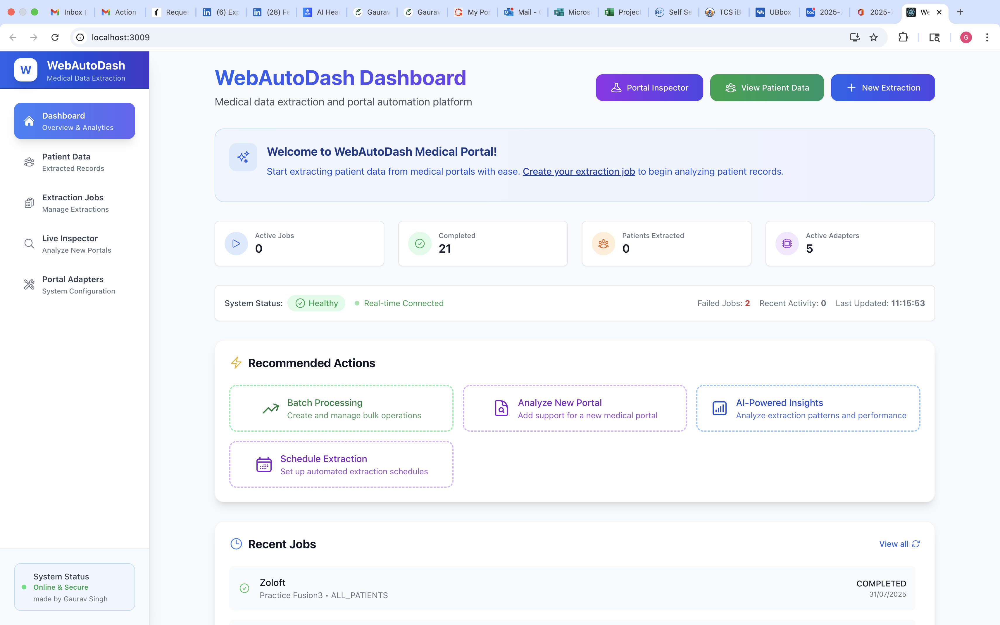
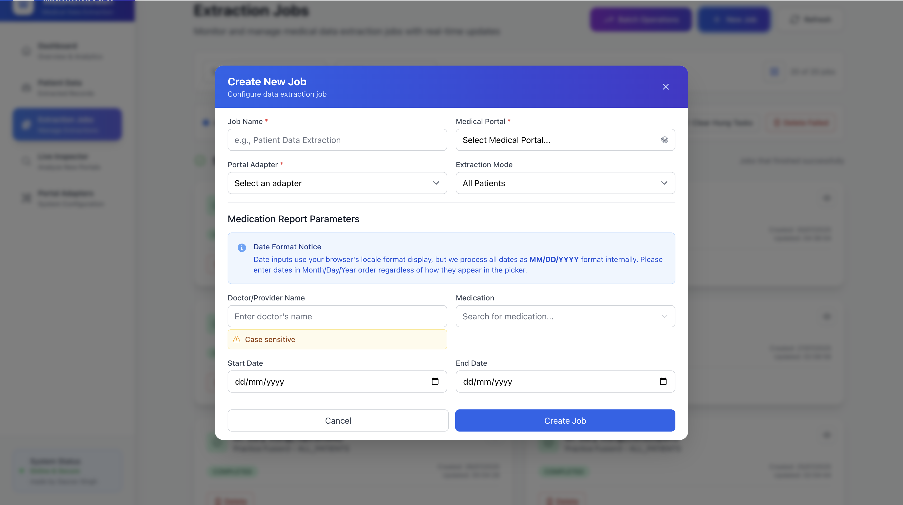
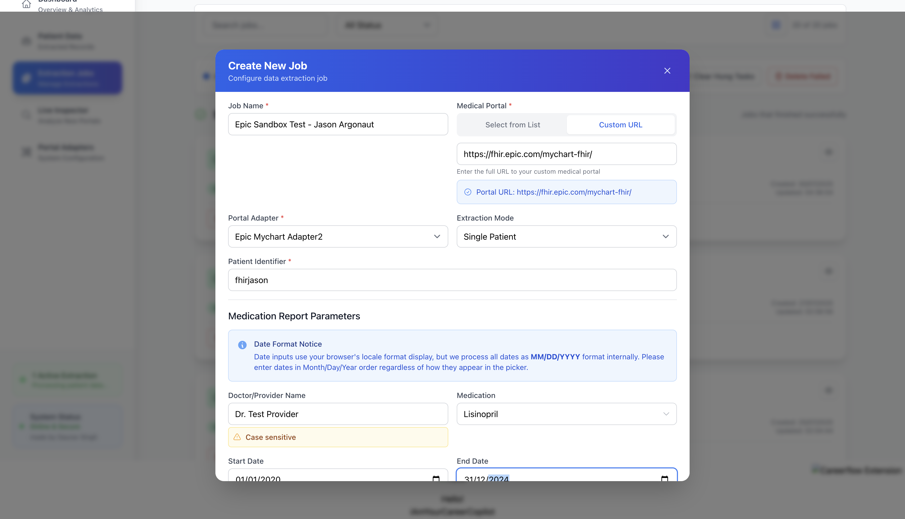
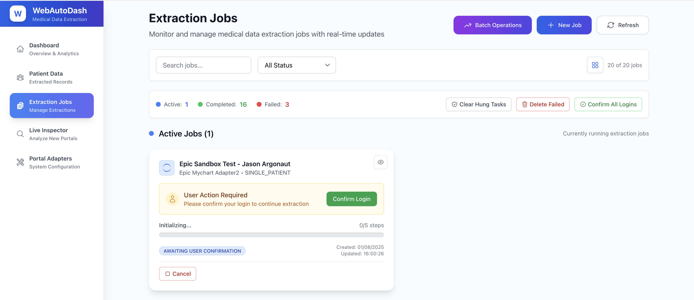
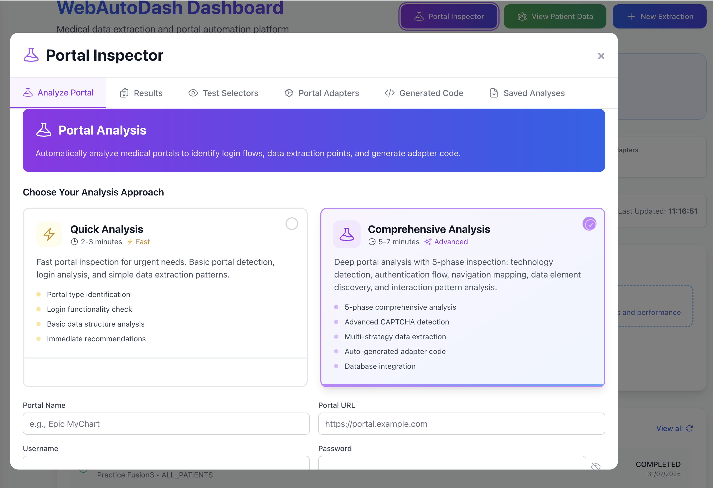
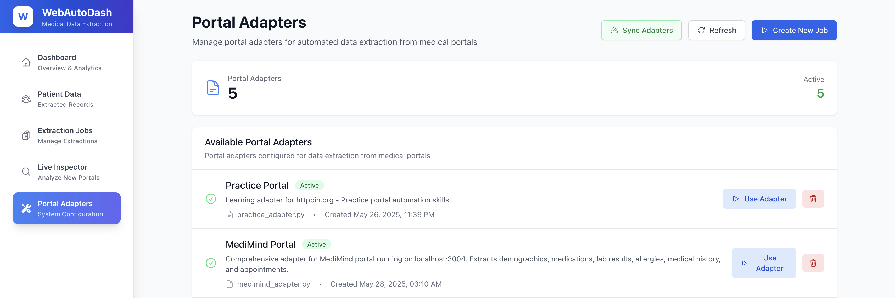

# 🏥 WebAuto-Dash

[](https://opensource.org/licenses/MIT)
[](https://www.python.org/downloads/)
[](https://reactjs.org/)
[](https://flask.palletsprojects.com/)

**An AI-powered browser automation dashboard for inspecting and extracting data from websites.**

WebAuto-Dash is a comprehensive web automation platform that combines intelligent browser automation with a modern dashboard interface. Built with React, Flask, and Playwright, it enables users to automate data extraction from complex web applications, inspect portal structures, and manage extraction jobs through an intuitive web interface.

---

## 🌟 Key Features

### 🔧 Core Automation
- **Intelligent Browser Automation**: Powered by Playwright for reliable cross-browser automation
- **Universal Portal Inspector**: Automatically analyze any web portal and generate custom extraction code
- **Multi-Portal Support**: Configurable adapters for different web systems and applications
- **Real-time Job Management**: Track automation jobs with live status updates and progress monitoring
- **Session Management**: Persistent login states and smart navigation handling

### 📊 Data Management & Analysis
- **Structured Data Extraction**: Extract tables, forms, and content with intelligent element detection
- **Flexible Export Options**: Export extracted data in CSV and JSON formats
- **Data Integrity**: Secure storage with SQLite database backend
- **Smart Resume Logic**: Intelligent resumption of interrupted extraction jobs
- **Comprehensive Logging**: Detailed extraction logs and debugging information

### 🎨 Modern User Interface
- **Responsive Dashboard**: Clean, professional interface built with Tailwind CSS
- **Real-time Updates**: Live dashboard with WebSocket support for instant status updates
- **Job Queue Management**: Visual job scheduling and execution monitoring
- **Portal Configuration**: Easy-to-use forms for setting up new portal adapters
- **Performance Metrics**: Built-in analytics and extraction performance tracking

### 🤖 Advanced Intelligence
- **Auto-Generated Adapters**: Create portal-specific extractors from automated analysis
- **Portal Structure Discovery**: Automatically map navigation flows and data patterns
- **Element Recognition**: Smart CSS selector generation and XPath pattern creation
- **Error Recovery**: Robust handling of portal changes and extraction failures

---

## 📸 Screenshots

Experience the power of WebAuto-Dash through our comprehensive dashboard interface:

### Main Dashboard Overview

*Comprehensive dashboard showing system status, active jobs, and performance metrics*

### Job Management Interface

*Intuitive job creation form with portal selection and configuration options*


*Advanced job settings with extraction parameters and scheduling options*


*Batch job management with multiple extraction tasks and progress tracking*


*Real-time job execution monitoring with detailed progress indicators*

### Portal Inspection & Automation

*Universal portal inspector for analyzing website structures and generating adapters*


*Live adapter creation interface with real-time portal analysis and code generation*

### Adapter Management

*Comprehensive adapter management with configuration options for different portal types*

---

## 📚 Documentation

### User Guides
- **[Universal Portal Inspector Guide](UNIVERSAL_PORTAL_INSPECTOR_GUIDE.md)** - Analyze any web portal automatically
- **[Startup Guide](STARTUP_GUIDE.md)** - Complete setup and configuration instructions
- **[Adapter Development Guide](ADAPTER_DEVELOPMENT_GUIDE.md)** - Create custom portal adapters

### Technical Documentation
- **[Portal Analysis Guide](COMPREHENSIVE_PORTAL_ANALYSIS_GUIDE.md)** - Deep portal inspection techniques
- **[Live Inspection Guide](LIVE_INSPECTION_FILE_GUIDE.md)** - Real-time portal debugging
- **[Doctor Visit Guide](DOCTOR_VISIT_INSPECTION_GUIDE.md)** - Healthcare-specific automation patterns

---

## 🏗️ Project Architecture

```
WebAuto-Dash/
├── frontend/                    # React.js Dashboard Application
│   ├── src/
│   │   ├── components/          # Reusable UI components
│   │   │   ├── JobProgressTracker.js
│   │   │   ├── PortalInspector.js
│   │   │   └── SystemMonitor.js
│   │   ├── pages/              # Main application pages
│   │   │   ├── Dashboard.js
│   │   │   ├── Jobs.js
│   │   │   ├── LiveInspection.js
│   │   │   └── PatientData.js
│   │   ├── services/           # API integration layer
│   │   └── hooks/              # Custom React hooks
│   └── public/                 # Static assets and manifest
├── backend/                    # Flask API Server
│   ├── app.py                  # Main Flask application entry point
│   ├── models.py               # Database models and schemas
│   ├── routes/                 # API route handlers
│   │   ├── jobs_api.py
│   │   ├── portal_inspector_api.py
│   │   └── realtime_api.py
│   └── requirements.txt        # Python dependencies
├── playwright_orchestrator/    # Browser Automation Engine
│   └── orchestrator.py         # Job execution and browser management
├── portal_adapters/            # Portal-Specific Adapters
│   ├── epic_mychart_adapter.py
│   ├── cerner_powerchart_adapter.py
│   └── example_adapter.py
└── templates/                  # Documentation and guides
```

---

## 🚀 Installation & Setup

### Prerequisites

- **Python 3.8+** with pip
- **Node.js 16+** with npm
- **Git** for version control

### 1. Clone the Repository

```bash
git clone https://github.com/gavksingh/WebAuto-Dash.git
cd WebAuto-Dash
```

### 2. Backend Setup

```bash
# Create virtual environment (recommended)
python -m venv venv
source venv/bin/activate  # On Windows: venv\Scripts\activate

# Navigate to backend directory
cd backend

# Install Python dependencies
pip install -r requirements.txt

# Initialize database
python -c "from app import create_app; from models import db; app = create_app(); app.app_context().push(); db.create_all()"
```

### 3. Frontend Setup

```bash
# Navigate to frontend directory
cd ../frontend

# Install Node.js dependencies
npm install

# Build the frontend (for production)
npm run build

# Or run in development mode
npm start
```

### 4. Install Playwright Browsers

```bash
# Install required browsers for automation
playwright install
```

### 5. Environment Configuration

Create environment files:

```bash
# backend/.env
DATABASE_URL=sqlite:///webautodash.db
SECRET_KEY=your-secret-key-here
FLASK_ENV=development

# frontend/.env (optional)
REACT_APP_API_URL=http://localhost:5000
REACT_APP_VERSION=1.0.0
```

---

## 🎯 Quick Start

### Option 1: Run Both Services (Recommended)

```bash
# From project root
./start_servers.sh
```

This will start both the Flask backend (port 5000) and React frontend (port 3009).

### Option 2: Run Services Separately

**Terminal 1 - Backend:**
```bash
cd backend
source venv/bin/activate  # Activate virtual environment
python app.py
```

**Terminal 2 - Frontend:**
```bash
cd frontend
npm start
```

### 3. Access the Application

- **🎛️ Main Dashboard**: http://localhost:3009
- **📡 Backend API**: http://localhost:5000
- **📚 API Documentation**: http://localhost:5000/api/docs

---

## 🔧 Technology Stack

### Frontend Technologies
- **React 18** - Modern component-based UI framework
- **Tailwind CSS** - Utility-first CSS framework for responsive design
- **Axios** - Promise-based HTTP client for API requests
- **Socket.io Client** - Real-time bidirectional communication
- **React Router** - Declarative routing for React applications
- **Heroicons** - Beautiful hand-crafted SVG icons

### Backend Technologies
- **Flask** - Lightweight and flexible web framework
- **SQLAlchemy** - Python SQL toolkit and Object Relational Mapping
- **Flask-SocketIO** - WebSocket integration for real-time features
- **Playwright** - Cross-browser automation library
- **Pydantic** - Data validation using Python type annotations
- **PyYAML** - YAML parser and emitter for configuration files

### Automation & Infrastructure
- **Playwright** - Reliable automation for Chromium, Firefox, and WebKit
- **SQLite** - Lightweight embedded database for development
- **Concurrent Processing** - Multi-threaded job execution
- **Session Persistence** - Secure login state management

---

## 🤝 Contributing

We welcome contributions from the community! Here's how you can help:

### Development Guidelines

1. **Fork the repository** and create your feature branch
   ```bash
   git checkout -b feature/amazing-feature
   ```

2. **Make your changes** following our coding standards
   - Frontend: Follow React best practices and use TypeScript when possible
   - Backend: Follow PEP 8 Python style guidelines
   - Testing: Add tests for new functionality

3. **Commit your changes** with descriptive messages
   ```bash
   git commit -m 'feat: Add amazing new feature'
   ```

4. **Push to your branch** and open a Pull Request
   ```bash
   git push origin feature/amazing-feature
   ```

### What We're Looking For

- 🐛 **Bug fixes** and performance improvements
- 📝 **Documentation** enhancements and examples
- 🔌 **New portal adapters** for popular web applications
- ✨ **UI/UX improvements** to the dashboard interface
- 🧪 **Test coverage** improvements and automation

---

## 🐛 Issues & Support

Having trouble? We're here to help!

### Getting Help

1. **📖 Check the documentation** - Most questions are answered in our guides
2. **🔍 Search existing issues** - Someone might have already reported your issue
3. **🆕 Create a new issue** - Use our issue templates for bug reports and feature requests
4. **💬 Join discussions** - Share ideas and get community support

### Reporting Issues

When reporting bugs, please include:
- Operating system and version
- Python and Node.js versions
- Steps to reproduce the issue
- Screenshots or error logs (if applicable)
- Expected vs. actual behavior

**🔗 [Report an Issue](https://github.com/gavksingh/WebAuto-Dash/issues/new)**

---

## 📄 License

This project is licensed under the **MIT License** - see the [LICENSE](LICENSE) file for complete details.

### What this means:
- ✅ **Commercial use** - Use WebAuto-Dash in commercial projects
- ✅ **Modification** - Modify the source code to fit your needs
- ✅ **Distribution** - Share and distribute the software
- ✅ **Private use** - Use privately without sharing modifications
- ⚠️ **Attribution required** - Include the original copyright notice

---

## 🙏 Acknowledgments

- **Playwright Team** - For building an amazing browser automation framework
- **React Community** - For the robust frontend ecosystem
- **Flask Contributors** - For the flexible web framework
- **Open Source Community** - For inspiration and collaborative development

---

## 🌟 Show Your Support

If WebAuto-Dash helps you automate your web workflows, please:

- ⭐ **Star this repository** to show your appreciation
- 🐛 **Report bugs** to help us improve
- 💡 **Suggest features** to make it even better
- 🤝 **Contribute code** to join our community

**Happy Automating! 🚀**